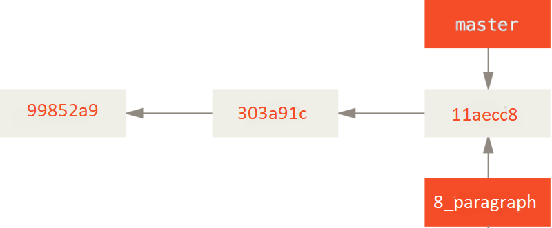
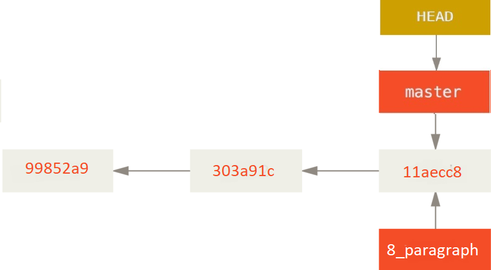

# Работа с Git

## Начало
## Установка Git.

Прежде чем использовать Git, вы должны установить его на своём компьютере. 
## Установка в Windows
Для установки в Windows программа доступна для скачивания на официальном сайте `Git`.  
Просто перейдите на страницу https://git-scm.com/download/win, и загрузка запустится автоматически.

## 1. Проверка наличия устаговленного Git
В рабочем терминале необходимо выполнить команду:
```
 `git version`.
 ```
Если Git установлен на ваш компьютер появится сообщение о версии программы. Иначе будет сообщение об ошибке 

## 2. Настройка Git
При первом использовании Git необходимо предствиться.   Для этого нкужно ввести в терминале две команды :
```
git config --global user.name "Имя пользователя"
git config --global.e-mail "почта пользователя"
```
## 3. Иницилизация репозитория для Windows

1. В созданую ранее папку Git,  можжно перейти  следующей командой:
```
$ cd C:/Users/user/Git
```
а затем выполните команду:
```
$ git init
```
Эта команда создаёт в текущем каталоге новый подкаталог с именем `.git`, содержащий все необходимые файлы репозитория Git . 

2. Возможно также клонировать репозиторий из любого места при помощи команды 
```
git clone <адрес репозитория>
```

## 4. Запись изменений в репозиторий

Каждый файл в созданом Git каталоге может находиться в одном из двух состояний: под **версионным** контролем ( *отслеживаемые* ) и нет ( *неотслеживаемые* ).

>Отслеживаемые - это те файлы, которые были в последнем снимке состояния проекта, о которых знает Git.

>Неотслеживаемые - это любые файлы в вашем рабочем каталоге, которые не входили в ваш последний снимок состояния, и не подготовлены к коммиту.


Как только вы отредактируете (измените) файлы, Git будет рассматривать их как изменённые. Далее необходимо индексировать эти изменения, затем зафиксировать все проиндексированные изменения.

 Пример
--------
*В момент написания этого предложения мы вносим изменения в отслеживаемый файл - `Git_instruction.md`
Выполним в терминале команду*
```
git status
```
*результат будет следующим:*
```
On branch master
Changes not staged for commit:
  (use "git add/rm <file>..." to update what will be committed)
  (use "git restore <file>..." to discard changes in working directory)
        modified:   Git_instruction.md

```
*Файл `Git_instruction.md` находится в секции **«Changes not staged for commit»** — это означает, что отслеживаемый файл был изменён в рабочем каталоге, но пока не проиндексирован.    
Чтобы проиндексировать его, необходимо выполнить команду:*
```
 git add
 ```
 *Это команда используется для для индексации изменений и добавления под версионный контроль новых файлов.  Таким образом мы добавляем наш новый контент в следующий коммит, но не как не добавляем текущий файл в проект.   
 Выполним:*
```
git add
```
*чтобы проиндексировать файл Git_instruction.md, а затем снова    выполним:*
```
git status
```
*Результатом наших действий будет:*
```
$ git add Git_instruction.md

vladi@HOME-PC MINGW64 ~/Desktop/Git (master)
$ git status
On branch master
Changes to be committed:
  (use "git restore --staged <file>..." to unstage)
        modified:   Git_instruction.md
```
**Примечание**  *  
*Если вы изменили файл после выполнения команды* 
``` 
git add
```
 *вам придётся снова выполнить её, чтобы проиндексировать последнюю версию файла.*

 ## 5. Сравнение изменений
 
 Чтобы увидеть, что было изменено, но пока не проиндексировано, можно наберать команду без аргументов:
 ```
  git diff 
  ```
Эта команда сравнивает содержимое папки Git каталога с содержимым индекса. Результат такого сравнения показывает ещё не проиндексированные изменения
Что бы посмотреть, что проиндексировано и что войдёт в следующий коммит, нужно выполнить 
```
git diff --staged
```
Эта команда сравнивает проиндексированные изменения с последним коммитом
### Важно!
**`Важно отметить, что `git diff`  сама по себе не показывает все изменения сделанные с последнего коммита — только те, что ещё не проиндексированы. Внимание! Если вы проиндексируете все свои изменения, то  `git diff` ничего не вернёт.`**


## 6. Коммит изменений

После индексации, можно зафиксировать свои изменения, тем самым запомнить, всё, что до сих пор было проиндексировано.  

**Примечание**  *

*— любые файлы, созданные или изменённые вами, и для которых вы не выполнили `git add`, после редактирования — не войдут в коммит.*

Для коммита изменений нужно набрать в командной строке :
```
git commit -m "свой комментарий к коммиту"
```
после параметра -m, вводим коментарий, который будет нам служить напоминанием, о том на каком этапе находлся наш файл в моментего коммита

 Пример
--------
*В момент написания этого предложения мы вносим изменения в отслеживаемый файл - `Git_instruction.md`
Выполним в терминале команду*
```
git add `Git_instruction.md`
```
теперь, когда проиндексирован файл Git_instruction.md
Выполним в терминале команду*
```
git commit -m "Для внесения Примера в Инструкцию"
```
*результат будет следующим:*
```
vladi@HOME-PC MINGW64 ~/Desktop/Git (master)
$ git commit -m "Для внесения Примера в Инструкцию"
[master ee71939] Для внесения Примера в Инструкцию
 1 file changed, 28 insertions(+), 13 deletions(-)
```
Поздравляю! Вы создали свой первый коммит.  
 Коммит вывел вам немного информации о себе:   
 - на какую ветку вы выполнили коммит (master)   
 - какая контрольная сумма SHA-1 у этого коммита (ee71939)  
  - сколько файлов было изменено, а также статистику по добавленным/удалённым строкам в этом коммите.
  ### Важно!
  **`Коммит сохраняет снимок состояния  индекса. ТО, что не проиндексировано, ОСТАЕТСЯ в рабочем каталоге как изменённое.  
  Коммит сохраняет снимок состояния проекта, который позже можно восстановить или с которым можно сравнить текущее состояние.`**

## 7. Просмотр истории коммитов
Когда создано несколько коммитов и для того чтобы   посмотреть что было сделано существует команда:
```
 git log
 ```

По умолчанию (без аргументов) git log перечисляет коммиты с низу вверх — последние коммиты находятся вверху. 

 Пример
--------
*Запустим команду в терминале:*
```
vladi@HOME-PC MINGW64 ~/Desktop/Git (master)
$ git log
commit 8b47c1ce85d4a88203216370fcfdb5bbd11d4890 (HEAD -> master)
Author: Your Name <you@example.com>
Date:   Fri Oct 14 17:17:25 2022 +0300

    Все до пункта 7

commit e8232107e1c94b7819d0bbd301e50cf1e3b86002
Author: Your Name <you@example.com>
:...skipping...
commit 8b47c1ce85d4a88203216370fcfdb5bbd11d4890 (HEAD -> master)
Author: Your Name <you@example.com>
Date:   Fri Oct 14 17:17:25 2022 +0300

    Все до пункта 7

commit e8232107e1c94b7819d0bbd301e50cf1e3b86002
Author: Your Name <you@example.com>
Date:   Fri Oct 14 17:10:26 2022 +0300

    Все до пункта 7

commit ee71939ecc1dec6973519d54bd783275c862e702
Author: Your Name <you@example.com>
Date:   Fri Oct 14 16:57:15 2022 +0300

    Для внесения Примера в Инструкцию

commit 45da093443dd491df02441a7a1215dbe7762b2a4
Author: Your Name <you@example.com>
Date:   Fri Oct 14 16:37:32 2022 +0300

    Добавил пункт 5 стал 6. В 5 пункт коммит

commit 506ab3c6d1f1199f2fe891099462f8f0aaed1a25
Author: Your Name <you@example.com>
Date:   Fri Oct 14 16:16:47 2022 +0300

    Добавил пункт 5  и внес изменения в Начало
```
Команда *`git log`* имеет опций для поиска коммитов по разным критериям.  
-p или --patch, показывает разницу (выводит патч), внесенную в каждый коммит.   
-можно ограничить количество записей в выводе команды используя параметр -2 для вывода только двух записей 

Пример
--------
*Запустим команду с одним из аргументов в терминале:*
```
vladi@HOME-PC MINGW64 ~/Desktop/Git (master)
$ git log -2
commit 8b47c1ce85d4a88203216370fcfdb5bbd11d4890 (HEAD -> master)
Author: Your Name <you@example.com>
Date:   Fri Oct 14 17:17:25 2022 +0300

    Все до пункта 7

commit e8232107e1c94b7819d0bbd301e50cf1e3b86002
Author: Your Name <you@example.com>
Date:   Fri Oct 14 17:10:26 2022 +0300

    Все до пункта 7
```    
Мы получили список только из двух последних коммитов.
Очень удобно использовать данную опцию для просмотра серии внесенных изменений.   

Команда
```
git log --oneline 
```
выводит каждый коммит в одну строку, что может быть очень удобным если вы просматриваете большое количество коммитов.  

Пример
--------
```
vladi@HOME-PC MINGW64 ~/Desktop/Git (master)
$ git log --oneline
8b47c1c (HEAD -> master) Все до пункта 7 
e823210 Все до пункта 7
ee71939 Для внесения Примера в Инструкцию
45da093 Добавил пункт 5 стал 6. В 5 пункт коммит
506ab3c Добавил пункт 5  и внес изменения в Начало
0a8d18b Добавил пункт 5  и внес изменения в Начало
940be48 Добавил пункт 4.1 и внес изменения в Начало
c8cbc8f Добавил пункт 5 Запись изменений в репозиторий с примерами работы в терминале
f3361ef Добавил пункт 5 Запись изменений в репозиторий с примерами работы в терминале
aa08460 Добавил пункт 5 Запись изменений в репозиторий с примерами работы в терминале
feeeb46 Добавил пункт 5 Запись изменений в репозиторий(определения)
c6a8710 Добавил пункт 4 -Иницилизация репозитория для Windows
a74b0c7 Переименовал файл и добавил пункт Начало
3522f30 Добавили позаголовок 4.Инициализация репозитория
```
Команда:
```
 git checkout 
 ```
 позволяет перемещаться между коммитами. 
 
Пример
--------
```
vladi@HOME-PC MINGW64 ~/Desktop/Git ((5f3e98c...))
$ git checkout 43da38
Warning: you are leaving 2 commits behind, not connected to
any of your branches:

  5f3e98c Окончание
  60add3c Окончание

If you want to keep them by creating a new branch, this may be a good time
to do so with:

 git branch <new-branch-name> 5f3e98c

HEAD is now at 43da380 Последний на пятницу
D       instruction.md
```
Для возврата в главный (Головной) коммит вводим в терминале:
```
git checkout master
```
## 8. Ветвление в Git 

Cистема контроля версий (Git) поддерживает ветвление. Ветвление это отклонение от основной линии разработки и продолжение работы независимо от неё, не вмешиваясь в основную линию. Ветвление Git очень легковесно. Это означает - операция создания ветки выполняется почти мгновенно, переключение между ветками, также быстро.  


**Примечание** *

*Ветка **master** в Git —  точно такая же, как и все остальные ветки. Её название создается автоматически командой **git init**, и в дальнейшем остается таким потому, что обычно это название не меняют.*

- Создание новой ветки

При создании ветки создаётся новый указатель на текущий коммит.

 Команда  *`git branch`*  только создаёт ветку, но не переключает на неё.  

 

 Если две ветки указывают на один и тотже коммит, 
 Git хранит специальный указатель HEAD - это указатель находится на текущкй локальной ветке. В нашем случае мы все еще находимся в ветке **master**.




 ## Переключение веток ## 


### Пример:
--------
*Запустим команду на создание еще одной ветки с назаванием: "8_paragraph_branching" в терменале:*


```
vladi@HOME-PC MINGW64 ~/Desktop/Git (8_paragraph)
$ git branch 8_paragraph_branching
```


Для переключения на созданную ветку необходимо выполнить команду *`git checkout`*. Давайте переключимся на новую  ветку 8_paragraph_branching:

```
git checkout 8_paragraph_branching
```
*Таким образом мы создали новую ветку **8_paragraph_branching**,
а затем перешли на нее из текущей. О чем нам показывает надпись в левом нижнем углу VS*   

![[VS1.png]](VS1.png)

В результате указатель HEAD переместится на ветку **8_paragraph_branching**.


Чтобы новая ветка получила свой коммит зафиксируем наши изменения:
```
vladi@HOME-PC MINGW64 ~/Desktop/Git (8_paragraph_branching)
$ git commit -a -m 'made a change'
[8_paragraph_branching ce664b4] made a change
 1 file changed, 7 insertions(+), 3 deletions(-)
 ```


 Указатель HEAD   переместился вперёд после коммита, а master указывает на тот же коммит, где и был до переключения веток командой *`git checkout`*. 
 
Если переключится назад на ветку master то:


HEAD перемещается когда выполняется команда *`checkout`*.
Эта команда делает две вещи:
- перемещает указатель HEAD назад на ветку master 
- возвращает файлы в рабочем каталоге в то состояние, на снимок которого указывает master.

Это также означает, что все вносимые с этого момента изменения будут относиться к старой версии проекта. Другими словами, мы откатили все изменения ветки **8_paragraph_branching** и можем продолжать в другом направлении.

### Важно!

 `Запомнить, что при переключении веток в Git происходит изменение файлов в рабочем каталоге. Если вы переключаетесь на старую ветку, то рабочий каталог будет выглядеть так же, как выглядел на момент последнего коммита в ту ветку.`


Если, при создании новой ветки вы хотите сразу на неё переключиться —  использйте команду git checkout -b "newbranchname".

# 9. Основы слияния

Когда робота в созданной ветке закончена её можно влить в ветку master. Для этого нужно выполнить слияние ветки выполнив команду:
```
git merge
```
Для начала работы по слиянию веток уточним их наличие и колличество командой:
```
git branch
```
Запустив в терминале этукоманду мы получили ответ:
```
vladi@HOME-PC MINGW64 ~/Desktop/Git (merger_paragraph)
$ git branch 
  8_paragraph
  8_paragraph_branching
  master
* merger_paragraph
```
Из полученого видно что у нас в работе на данный момент имеется 4 ветки:
  - 8_paragraph
  - 8_paragraph_branching
  - master
  - merger_paragraph  

А знак звездочки (* ) указывает на какой из четырех веток находится наш процесс. Мы находимся и продолжаем работу над 9 пунктом инструкции к Git в ветке `merger_paragraph`  (Пункт о слиянии).  
 Для того чтобы созданные ветки, несущие в себе отдельную информацию, обьединились в одну, нужно переключиться на ветку, в которую нужно включить изменения, и выполнить команду слияния.

В процессе слияния веток мы могли видеть, каие изменения будут происходить в результате:


Иногда процесс слияния не проходит гладко. Если мы изменим одну и ту же часть одного и того же файла по-разному в двух объединяемых ветках, Git не сможет их чисто объединить. Чтобы разрешить конфликт, придётся выбрать один из вариантов, либо объединить содержимое по-своему. Разрешив каждый конфликт во всех файлах, запустим `git add` для каждого файла, чтобы отметить конфликт как решённый. Добавление файла в индекс означает для Git, что все конфликты в нём исправлены.

# 10. Удалённые ветки


Зачем удалять ветки в Git?
Итак, мы создали ветку, чтобы работать в ней над какими-то изменениями. Затем мы слили свои изменения в исходную версию проекта.

Это значит, что вам больше не нужна ветка, в которой мы работали над изменениями. Удалив ее мы получим то, что она не будет мешаться в нашем процессе.

Команда для удаления локальной ветки в Git:
```
git branch -d  local_branch_name
```
- git branch – команда для удаления локальной ветки.  
- -d – флаг, опция команды git branch, сокращенный вариант записи --delete. Как и следует из названия, предназначен для удаления ветки.  
- local_branch_name – имя удаляемой ветки.

### Важно!

`Удалить ветку, в которой находитесь и которую просматриваете в данный момент, НЕЛЬЗЯ .
Если мы попытаться это сделать, то получим ошибку. Так что перед удалением локальной ветки обязательно переключитесь на другую, которую не собираетесь удалять.`

Для удаления ветки мы использовали команду 
```
git branch -d
```
 Но она работает не во всех случаях.
Если в ветке присутствуют изменения и незапушенные коммиты, флаг -d не позволит удалить такую локальную ветку. Это связано с тем, что эти коммиты нигде более не отслеживаются, и Git защищает вас от случайной потери этих данных. Если все же попытаться удалить такую ветку, Git выдаст ошибку. Флаг "-D" с большой D , принудительно удаляет локальную ветку, вне зависимости от ее статуса.

Используйте данную команду с осторожностью: после её ввода у вас не будут просить подтверждение удаления. Прибегайте к ней только когда абсолютно уверены, что хотите удалить локальную ветку.
Если вы не объединили её с другой локальной веткой  вы рискуете потерять все произведённые изменения.  
   

# 11 Работа с удаленным репозиторием

Удаленный (иногда говорят "внешний") репозиторий – это версии нашего проекта, сохраненные на удаленном сервере.Удаленный репозиторий – полноценный репозиторий, ничем не отличающийся от локального. У удаленного репозитория есть собственные ветки, собственный указатель HEAD, своя история коммитов и так далее.
Если мы подключим удаленный репозиторий к своему локальному, то у нас появятся копии всех ссылочных объектов удаленного репозитория. То есть, например, у удаленного репозитория есть ветка main, а у нас будет копия этой ветки – origin/main

Коммит, созданный нами, хранится в репозитарии, т.е. является локальным. Это нам нужно, когда работа идет над проектом самостоятельно. Однако в большинстве случаев возникает необходимость обеспечить доступ к результатам работы и другим пользователям.

## Как подключиться к удаленному репозитарию?

Для загрузки данных в удаленный репозитарию сначала нужно к нему подключиться. В нашем примере мы используем адрес https://github.com/VoldMarius/VoldMarius.git. Для того, чтобы связать созданный нами локальный репозитарий с удаленным, выполним такую команду:
```
 git remote add origin https://github.com/VoldMarius/VoldMarius.git
 ```


## Как отправить изменения в удаленный репозитарий?

Теперь, когда у нас в локальном репозитарии создан коммит и мы подключились к удаленному, можем отправить его на сервер. Мы это будем делать каждый раз, когда хотим обновить данные в удаленном репозитарии. Отправка коммита осуществляется с помощью команды push, которая имеет два параметра - имя удаленного репозитория (в нашем случае origin) и ветку, в которую необходимо внести изменения (RequestBranch).
```
git push --set-upstream origin RequestBranch
```


Все сделано правильно, отправленный файл Git_instruction.md на удаленном сервере мы можем увидеть с помощью браузера.  
Команда `git push` используется для установления связи с удалённым репозиторием, вычисления локальных изменений отсутствующих в нём, и собственно их передачи в вышеупомянутый репозиторий. Этой команде нужно право на запись в репозиторий, поэтому она использует аутентификацию.

## Получение изменений из удаленного репозитория. 

Команда:
```
 git pull
```
